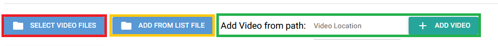
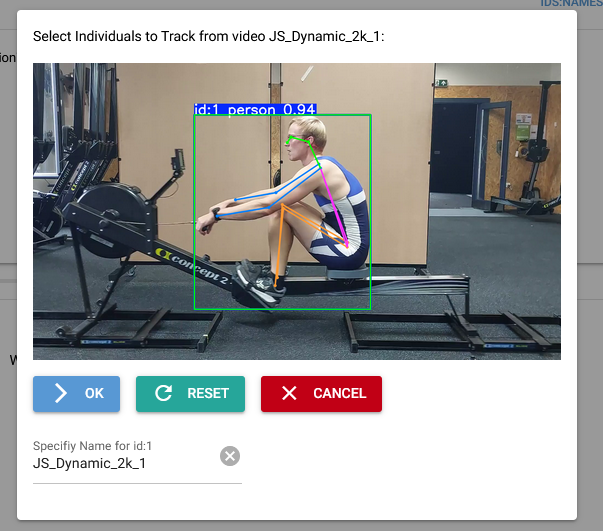

# NicePoseGUI
A [NiceGUI](https://nicegui.io/) wrapper for tracking individuals in videos using pose estimation tools - primarily [ultralytics](https://github.com/ultralytics) YOLO models.


NicePoseGUI provides an interface to select videos, indicate which individuals should be tracked and have their joint positions recorded and then outputs the data for the selected indivudals in a simple json format.

The JSON format looks like this:
```JSON
{
    "video" : "original video name",
    "model" : "model used to generate data",
    "framerate" : "framerate of video",
    "points" : {
        "name1" : {
            "L_Ankle": {
                "c" : [0.1, 0.2, 0.3, "..."],
                "x" : [101, 102, 103, "..."],
                "y" : [104, 105, 106, "..."]
            },
            "R_Ankle" : {
                "c" : [0.1, 0.2, 0.3, "..."],
                "x" : [101, 102, 103, "..."],
                "y" : [104, 105, 106, "..."]
            },
            {"etc..."}
        },
        "name2" : {
            "L_Ankle" : {"..."}
        }
    }
}
```

## Installation
[Pytorch](https://pytorch.org/get-started/locally/) will need to be installed prior to installing the rest of the requirements (`pip install -r requirements.txt`). For the sake of speed and compatibility, it is recommended to use one of the CUDA compatile versions so that GPU compute can be used. GPU compute tends to be ~25x faster than running on CPU.

## Use Guide
1. Select videos to run pose estimation on. This can be done a few ways: 
   1. <code style="color : red">Select from Explore</code> - Opens a file picker where a single or multile files can be selected.
   2. <code style="color : orange">Provide List File</code> - Opens a file picker looking for a `.txt` file where paths to multiple video files are listed.
   3. <code style="color : green">Select from Explorer</code> - Enter a path to a video file, pressing the "Add Video" button to add it to the table.
2. Select individuals from each video to track (Press the "Select People" button). When selected, a green box will appear around the individual. Unique Names/Labels for each individual should be provided. <center></center>

3. Run Pose Estimation. Progress will be shown on the table of selected videos. Progress bar at the bottom of the table indicates progress on the video currently being worked on.
